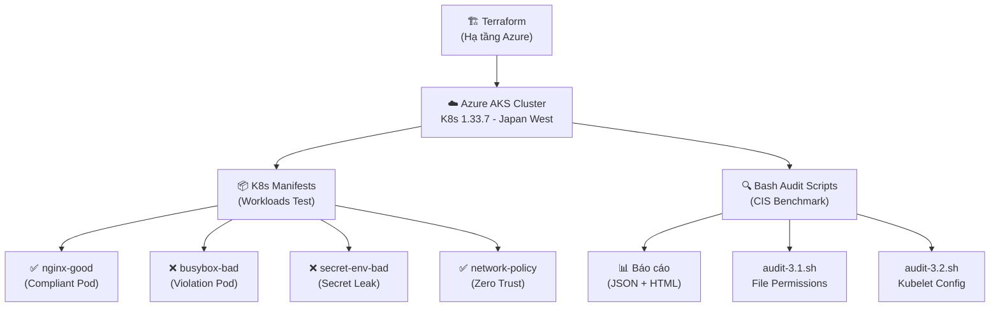
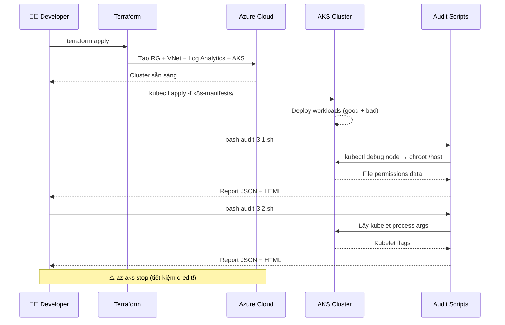

# 🔍 Phân Tích Dự Án: CIS AKS Benchmark Audit

## Tổng Quan

Đây là dự án **đồ án nhóm môn NT542** (Lập trình kịch bản) tại UIT, thực hiện kiểm tra bảo mật (**security audit**) trên cụm **Azure Kubernetes Service (AKS)** theo tiêu chuẩn **CIS AKS Benchmark v1.8.0**.

> [!IMPORTANT]
> Dự án sử dụng **shell scripting** (Bash) kết hợp **Terraform** (IaC) để tự động hóa việc triển khai hạ tầng và kiểm tra tuân thủ bảo mật trên Kubernetes.

---

## Kiến Trúc Dự Án

---

## Cấu Trúc Thư Mục

| Thư mục / File | Mô tả |
|---|---|
| `terraform/` | Mã IaC để dựng toàn bộ hạ tầng Azure (VNet, Log Analytics, AKS) |
| `scripts/audit/tier1-node/` | Scripts audit cấp Node (quyền file, ownership) |
| `scripts/audit/tier2-kubelet/` | Scripts audit cấp Kubelet (cấu hình bảo mật kubelet) |
| `scripts/helpers/common.sh` | Thư viện hàm dùng chung: logging, debug pod, report engine |
| `k8s-manifests/` | Workloads Kubernetes mẫu (cả tốt và xấu) để test audit |
| `report/` | Báo cáo kết quả audit (JSON + HTML) |

---

## Chi Tiết Từng Thành Phần

### 1. 🏗️ Terraform — Hạ tầng Azure

[main.tf](file:///d:/study/UIT/%5BNT542%5D%20-%20L%E1%BA%ADp%20tr%C3%ACnh%20k%E1%BB%8Bch%20b%E1%BA%A3n/B%C3%A0i%20t%E1%BA%ADp%20nh%C3%B3m/Homework/Project/cis-aks-audit/terraform/main.tf) tạo các tài nguyên:

| Resource | Tên | Mục đích |
|---|---|---|
| Resource Group | `rg-cis-aks-audit` | Nhóm chứa mọi tài nguyên |
| Virtual Network | `vnet-aks-audit` (10.0.0.0/16) | Kiểm soát network cho audit 4.4.x |
| Subnet | `snet-aks-nodes` (10.0.1.0/24) | Subnet riêng cho AKS nodes |
| Log Analytics | `log-aks-audit` | Monitoring cho controls 5.1.x |
| AKS Cluster | `aks-cis-audit` | K8s 1.33.7, 1 node D2s_v3, Azure CNI + Calico |

**Cấu hình bảo mật đáng chú ý:**
- **Azure CNI + Calico** → hỗ trợ Network Policy (controls 4.4.x, 5.4.4)
- **`enable_node_public_ip = false`** → nodes không có IP public (control 5.4.3)
- **RBAC enabled** → kiểm soát truy cập (controls 4.1.x)
- **OMS Agent** → Container Insights cho logging (controls 5.1.x)
- **SSH Key** → truy cập node để audit (controls 3.1.x, 3.2.x)

---

### 2. 🔍 Audit Scripts (Bash)

#### [common.sh](file:///d:/study/UIT/%5BNT542%5D%20-%20L%E1%BA%ADp%20tr%C3%ACnh%20k%E1%BB%8Bch%20b%E1%BA%A3n/B%C3%A0i%20t%E1%BA%ADp%20nh%C3%B3m/Homework/Project/cis-aks-audit/scripts/helpers/common.sh) — Thư viện hàm (~270 dòng)
- **Logging** có màu (PASS/FAIL/WARN)
- **Debug Pod** management: tạo pod Ubuntu trên node, exec lệnh qua `chroot /host`, tự dọn dẹp
- **Report Engine**: ghi kết quả TSV → xuất JSON + HTML đẹp
- **Remediation**: hỏi user có muốn tự động sửa lỗi không

#### [audit-3.1.sh](file:///d:/study/UIT/%5BNT542%5D%20-%20L%E1%BA%ADp%20tr%C3%ACnh%20k%E1%BB%8Bch%20b%E1%BA%A3n/B%C3%A0i%20t%E1%BA%ADp%20nh%C3%B3m/Homework/Project/cis-aks-audit/scripts/audit/tier1-node/audit-3.1.sh) — Section 3.1: Worker Node File Permissions

| Control | Kiểm tra | Kỳ vọng |
|---|---|---|
| 3.1.1 | Quyền file kubeconfig | ≤ 644 |
| 3.1.2 | Ownership kubeconfig | root:root |
| 3.1.3 | Quyền file azure.json | ≤ 644 |
| 3.1.4 | Ownership azure.json | root:root |

> [!TIP]
> Script tối ưu bằng cách **gộp tất cả lệnh kiểm tra thành 1 batch duy nhất** rồi parse kết quả — giảm thiểu số lần exec vào node.

#### [audit-3.2.sh](file:///d:/study/UIT/%5BNT542%5D%20-%20L%E1%BA%ADp%20tr%C3%ACnh%20k%E1%BB%8Bch%20b%E1%BA%A3n/B%C3%A0i%20t%E1%BA%ADp%20nh%C3%B3m/Homework/Project/cis-aks-audit/scripts/audit/tier2-kubelet/audit-3.2.sh) — Section 3.2: Kubelet Configuration

| Control | Kiểm tra Flag | PASS nếu |
|---|---|---|
| 3.2.1 | `--anonymous-auth` | `= false` |
| 3.2.2 | `--authorization-mode` | `≠ AlwaysAllow` |
| 3.2.3 | `--client-ca-file` | Set và file tồn tại |
| 3.2.4 | `--read-only-port` | `= 0` |
| 3.2.5 | `--streaming-connection-idle-timeout` | `≠ 0` |
| 3.2.6 | `--make-iptables-util-chains` | `≠ false` |
| 3.2.7 | `--event-qps` | `≥ 0` |
| 3.2.8 | `--rotate-certificates` | `≠ false` |
| 3.2.9 | `RotateKubeletServerCertificate` | `= true` |

---

### 3. 📦 K8s Manifests — Workloads Test

Các manifest được thiết kế **có chủ đích** để tạo ra cả trường hợp PASS và FAIL khi audit:

| File | Loại | Mục đích |
|---|---|---|
| `01-namespaces.yaml` | ✅ Setup | Tạo ns `dev` + `staging` |
| `02-nginx-good.yaml` | ✅ Compliant | Pod tuân thủ mọi best practice (non-root, no privileged, drop ALL caps, readOnlyRootFS) |
| `03-busybox-bad.yaml` | ❌ Violation | Pod cố tình vi phạm 5 controls (hostPID, hostIPC, hostNetwork, privileged, allowPrivilegeEscalation) |
| `04-secret-env-bad.yaml` | ❌ Violation | Secret inject qua env var thay vì volume mount (vi phạm 4.5.1) |
| `05-network-policy.yaml` | ✅/❌ Mixed | NetworkPolicy cho `dev` (PASS) — `staging` cố tình không có (FAIL) |

---

### 4. 📊 Kết Quả Audit Gần Nhất (10/04/2026)

#### Section 3.1 — File Permissions: **4/4 PASS** ✅
| Control | Status | Detail |
|---|---|---|
| 3.1.1 | ✅ PASS | Perm: 600 |
| 3.1.2 | ✅ PASS | Owner: root:root |
| 3.1.3 | ✅ PASS | Perm: 600 |
| 3.1.4 | ✅ PASS | Owner: root:root |

#### Section 3.2 — Kubelet Config: **9/9 PASS** ✅
| Control | Status | Detail |
|---|---|---|
| 3.2.1 | ✅ PASS | `--anonymous-auth = false` |
| 3.2.2 | ✅ PASS | `--authorization-mode = Webhook` |
| 3.2.3 | ✅ PASS | `--client-ca-file = /etc/kubernetes/certs/ca.crt` |
| 3.2.4 | ✅ PASS | `--read-only-port = 0` |
| 3.2.5 | ✅ PASS | `--streaming-connection-idle-timeout = 4h` |
| 3.2.6 | ✅ PASS | `--make-iptables-util-chains = true` |
| 3.2.7 | ✅ PASS | `--event-qps = 0` |
| 3.2.8 | ✅ PASS | `--rotate-certificates = true` |
| 3.2.9 | ✅ PASS | `RotateKubeletServerCertificate = true` |

---

## Workflow Vận Hành

---

## Đánh Giá Chung

### ✅ Điểm mạnh
1. **Infrastructure as Code** hoàn chỉnh — toàn bộ hạ tầng tái tạo được bằng 1 lệnh `terraform apply`
2. **Comment tiếng Việt chi tiết** — dễ hiểu cho thành viên nhóm
3. **Report Engine** chuyên nghiệp — xuất cả JSON (cho automation) và HTML (cho trình bày)
4. **Test strategy thông minh** — tạo cả pod "tốt" và "xấu" để chứng minh audit detect đúng
5. **Remediation tương tác** — script hỏi trước khi tự động sửa lỗi
6. **Tối ưu hiệu suất** — batch commands, giảm roundtrip tới node

### ⚠️ Còn thiếu / Có thể mở rộng
1. **Chỉ có 2/6 sections** (3.1 và 3.2) — CIS AKS Benchmark v1.8.0 còn các sections 4.x (Policies), 5.x (Managed Services)
2. **Chưa có script audit cho k8s-manifests** — các file `02-05` đã deploy nhưng chưa thấy script audit tương ứng (4.2.x, 4.4.x, 4.5.x)
3. **Chưa có CI/CD** — có thể thêm GitHub Actions để chạy audit tự động
4. **Chưa có aggregated dashboard** — gộp tất cả report sections vào 1 trang HTML tổng hợp
